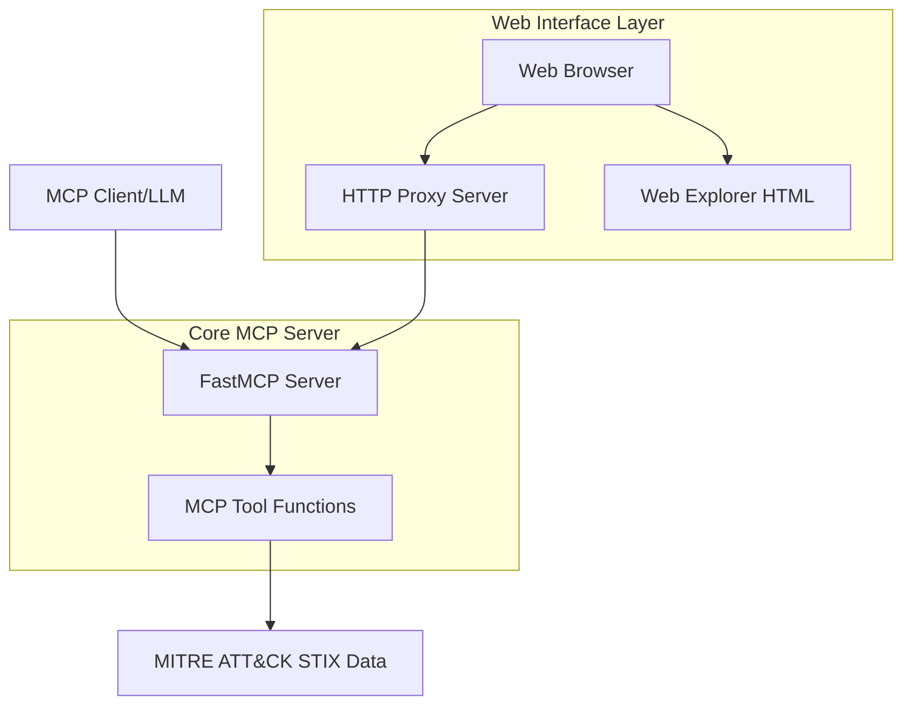

# Design Document

## Overview

The MITRE ATT&CK MCP Server is a Model Context Protocol server built with Python 3 and the official MCP library (FastMCP) that provides comprehensive access to the MITRE ATT&CK framework data. This implementation provides both **basic analysis tools** for fundamental queries and **advanced threat modeling capabilities** for sophisticated security workflows. The server includes a web-based interface for non-technical users and supports configurable deployment options.

## Architecture

The enhanced MCP server architecture includes multiple access methods:



### Core Components:

1. **FastMCP Server**: Handles MCP protocol communication using the official MCP library
2. **HTTP Proxy Server**: Provides HTTP/JSON API access to MCP tools for web interface
3. **Web Explorer Interface**: Interactive HTML interface for browser-based access
4. **MCP Tool Functions**: 8 comprehensive tools (5 basic + 3 advanced) using @app.tool()
5. **Data Loading**: STIX JSON loading and parsing with relationship analysis
6. **Configuration System**: Environment-based configuration for flexible deployment

## MCP Tools Architecture

### Basic Analysis Tools (5 Core Tools)

#### 1. `search_attack`
- **Purpose**: Global search across all ATT&CK entities (tactics, techniques, groups, mitigations)
- **Parameters**:
  - `query` (required): Search term
- **Returns**: Mixed results with entity type indicators

#### 2. `get_technique`
- **Purpose**: Get detailed information about a specific technique
- **Parameters**:
  - `technique_id` (required): MITRE technique ID (e.g., "T1055")
- **Returns**: Full technique details including tactics, platforms, mitigations

#### 3. `list_tactics`
- **Purpose**: Get all MITRE ATT&CK tactics
- **Parameters**: None
- **Returns**: List of all tactics with IDs, names, and descriptions

#### 4. `get_group_techniques`
- **Purpose**: Get all techniques used by a specific threat group
- **Parameters**:
  - `group_id` (required): MITRE group ID (e.g., "G0016")
- **Returns**: List of techniques with basic information

#### 5. `get_technique_mitigations`
- **Purpose**: Get mitigations for a specific technique
- **Parameters**:
  - `technique_id` (required): MITRE technique ID
- **Returns**: List of applicable mitigations

### Advanced Threat Modeling Tools (3 Sophisticated Tools)

#### 6. `build_attack_path`
- **Purpose**: Construct multi-stage attack paths through the MITRE ATT&CK kill chain
- **Parameters**:
  - `start_tactic` (required): Starting tactic ID (e.g., "TA0001")
  - `end_tactic` (required): Target tactic ID (e.g., "TA0040")
  - `group_id` (optional): Filter by specific threat group
  - `platform` (optional): Filter by platform (Windows, Linux, macOS)
- **Returns**: Structured attack path with technique progression and analysis

#### 7. `analyze_coverage_gaps`
- **Purpose**: Analyze defensive coverage gaps against threat groups
- **Parameters**:
  - `threat_groups` (required): Array of threat group IDs
  - `technique_list` (optional): Array of specific techniques to analyze
  - `exclude_mitigations` (optional): Array of implemented mitigation IDs to exclude
- **Returns**: Coverage gap analysis with percentages and recommendations

#### 8. `detect_technique_relationships`
- **Purpose**: Discover complex STIX relationships and attribution chains
- **Parameters**:
  - `technique_id` (required): Primary technique to analyze
  - `relationship_types` (optional): Array of relationship types to include
  - `depth` (optional): Relationship traversal depth (default: 2, max: 3)
- **Returns**: Complex relationship analysis with hierarchies and attribution chains

## Web Interface Architecture

### HTTP Proxy Server (`http_proxy.py`)
- **Purpose**: Provides HTTP/JSON API bridge to MCP tools
- **Port Configuration**: Environment variable `MCP_HTTP_PORT` (default: 8000)
- **Endpoints**:
  - `GET /` - Serves web explorer interface
  - `GET /tools` - Returns available tools list
  - `POST /call_tool` - Executes MCP tools via HTTP

### Web Explorer Interface (`web_explorer.html`)
- **Purpose**: Interactive browser-based interface for all MCP tools
- **Features**:
  - **Basic Tools Section**: Simple forms for fundamental queries
  - **Advanced Tools Section**: Complex forms with array inputs and multi-select
  - **Real-time Results**: Formatted output display with proper styling
  - **Responsive Design**: Works across different browsers and devices

### Launcher Script (`start_explorer.py`)
- **Purpose**: Convenient startup script for web interface
- **Configuration**: Supports environment variables for host/port settings
- **Features**: Automatic browser opening and server status monitoring

## Data Models and Processing

### Enhanced Data Models (Python Dictionaries with Relationships)

#### Technique (Enhanced)
```python
{
  "id": "T1055",
  "name": "Process Injection",
  "description": "Adversaries may inject code into processes...",
  "tactics": ["TA0004", "TA0005"],
  "platforms": ["Windows", "Linux"],
  "mitigations": ["M1040", "M1026"],
  "relationships": [
    {
      "type": "uses",
      "source_ref": "intrusion-set--uuid",
      "target_ref": "attack-pattern--uuid"
    }
  ]
}
```

#### Attack Path Structure
```python
{
  "path_id": "path_001",
  "start_tactic": "TA0001",
  "end_tactic": "TA0040",
  "steps": [
    {
      "tactic": "TA0001",
      "techniques": ["T1566", "T1078"],
      "description": "Initial Access techniques..."
    }
  ],
  "completeness": "complete|incomplete",
  "total_techniques": 15
}
```

#### Coverage Gap Analysis
```python
{
  "analysis_id": "gap_001",
  "threat_groups": ["G0016", "G0032"],
  "total_techniques": 45,
  "covered_techniques": 32,
  "coverage_percentage": 71.1,
  "gaps": [
    {
      "technique_id": "T1055",
      "priority": "high",
      "groups_using": ["G0016", "G0032"]
    }
  ]
}
```

## Configuration and Deployment

### Environment Variables
```bash
# MCP Server Configuration
MCP_SERVER_HOST=localhost    # Default: localhost
MCP_SERVER_PORT=3000        # Default: 3000

# HTTP Proxy Configuration  
MCP_HTTP_HOST=localhost     # Default: localhost
MCP_HTTP_PORT=8000         # Default: 8000

# Data Source Configuration
MITRE_ATTACK_URL=https://raw.githubusercontent.com/mitre/cti/master/enterprise-attack/enterprise-attack.json
```

### Configuration Files
- `config/data_sources.yaml` - Data source definitions
- `config/entity_schemas.yaml` - Entity type schemas  
- `config/tools.yaml` - MCP tool configurations
- `.env` - Local environment variable overrides

## Data Sources and Processing

### MITRE ATT&CK STIX Data (Enhanced)
- **Source**: Official MITRE ATT&CK STIX JSON file from GitHub
- **URL**: `https://raw.githubusercontent.com/mitre/cti/master/enterprise-attack/enterprise-attack.json`
- **Format**: STIX 2.1 JSON with relationship objects
- **Processing**: Enhanced relationship extraction and analysis

### Enhanced Data Processing Pipeline
1. **Download**: Fetch STIX JSON file using `requests` with error handling
2. **Parse**: Use official `stix2` library for secure STIX data parsing
3. **Extract**: Process attack-pattern, course-of-action, intrusion-set, and relationship objects
4. **Analyze**: Build relationship graphs and attribution chains
5. **Cache**: Store processed data with relationships in memory for fast access
6. **Validate**: Use `pydantic` models for data validation and type safety

## Testing Strategy

### Comprehensive Test Coverage
- **Unit Tests**: All 8 MCP tools with mock data (167 tests passing)
- **Integration Tests**: HTTP proxy and web interface functionality
- **Relationship Tests**: Complex STIX relationship traversal and analysis
- **Configuration Tests**: Environment variable and config file validation
- **Error Handling Tests**: Graceful failure scenarios and edge cases

### Test Organization
- **Location**: All tests in `tests/` directory following pytest conventions
- **Structure**: One test file per module (`test_<module_name>.py`)
- **Coverage**: Comprehensive coverage of both basic and advanced functionality
- **Mocking**: Proper mocking of external dependencies and data sources

## Implementation Considerations

### Technology Stack (Enhanced)
- **Python 3**: Core language with type hints
- **FastMCP**: Official MCP server implementation
- **mcp**: Official Model Context Protocol SDK
- **stix2**: Official STIX 2.x library for secure parsing
- **requests**: HTTP client for data downloading
- **pydantic**: Data validation and type safety
- **pyyaml**: Configuration file parsing
- **pytest**: Comprehensive testing framework

### Performance and Scalability
- **In-Memory Storage**: All data loaded at startup for fast access
- **Relationship Caching**: Pre-computed relationship graphs for advanced tools
- **Efficient Search**: Optimized search algorithms across large datasets
- **Concurrent Access**: Thread-safe data structures for multi-user access

### Security Considerations
- **Input Validation**: Comprehensive parameter validation for all tools
- **STIX Parsing**: Use official libraries for secure external data parsing
- **Error Handling**: Graceful error handling without information disclosure
- **Configuration Security**: Environment-based secrets management

### Extensibility Features
- **Configuration-Driven**: Easy addition of new data sources and tools
- **Modular Architecture**: Clean separation between core logic and tool implementations
- **Plugin System**: Framework for adding custom analysis tools
- **API Compatibility**: Consistent interfaces for both MCP and HTTP access